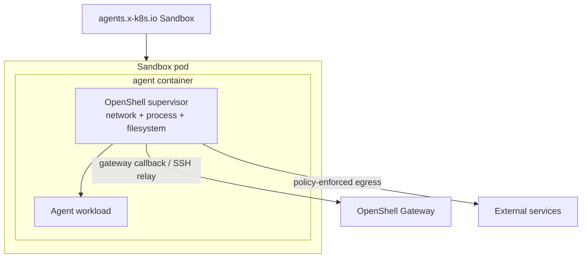
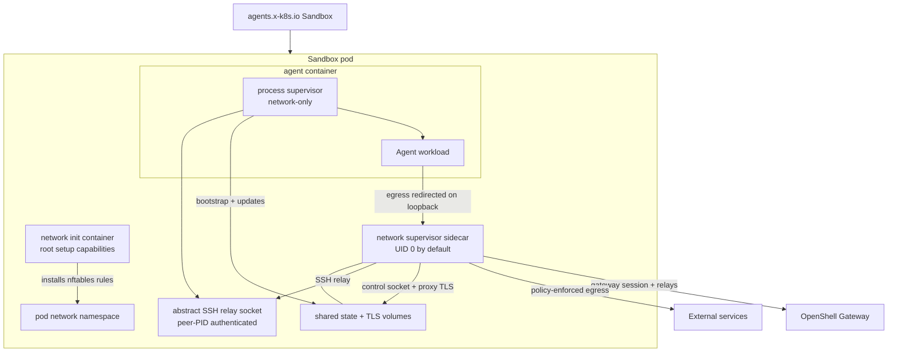
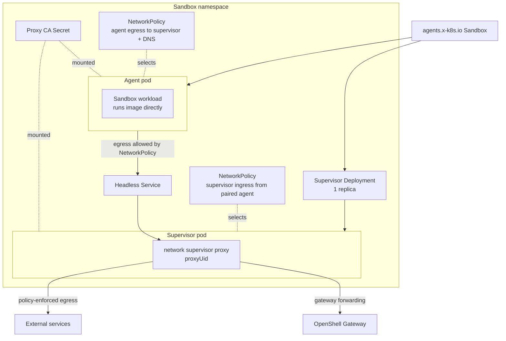

Kubernetes sandbox pods can run the OpenShell supervisor in `combined`,
`sidecar`, or `proxy-pod` topology. Choose the topology based on which controls
you need inside the pod, how much privilege your cluster allows on the agent
container, and whether the cluster enforces Kubernetes NetworkPolicies.

## Choose a Topology

The default `combined` topology preserves the full OpenShell enforcement model.
Use `sidecar` only when you accept network-focused enforcement in exchange for a
lower-privilege agent container.

| Topology | Use when | Main tradeoff |
|---|---|---|
| `combined` | You need OpenShell network, filesystem, and process controls in the sandbox workload. | The agent container carries the Linux capabilities the supervisor needs. |
| `sidecar` | You need the agent container to run as non-root without added Linux capabilities, and network policy is the primary control. | Privilege-dropping and supervisor mount isolation do not run in the agent container. |
| `proxy-pod` | You need network enforcement outside the agent pod, accept a workload-only sandbox container, and your cluster enforces Kubernetes NetworkPolicies. | No sandbox supervisor: filesystem/process/binary controls, SSH, exec, upload/download, sync, and provider injection are unavailable. |

## Privilege Model

The long-running container permissions differ by topology:

| Topology | Pod or container | UID/GID | Privilege escalation | Capabilities | Result |
|---|---|---|---|---|---|
| `combined` | Agent container, which also runs the supervisor | Not forced by topology | Not explicitly disabled by the driver | Adds `SYS_ADMIN`, `NET_ADMIN`, `SYS_PTRACE`, and `SYSLOG`; adds `SETUID`, `SETGID`, and `DAC_READ_SEARCH` when user namespaces are enabled | Full supervisor controls run in the agent container. |
| `sidecar` | Agent container, process-only supervisor (`network-only`) | `sandbox_uid:sandbox_gid` | `false` | Drops `ALL` | Agent and workload run without added Linux capabilities. |
| `sidecar` | Network supervisor sidecar, binary-aware mode (default) | `0:sandbox_gid` | `false` | Drops `ALL`; adds `SYS_PTRACE` and `DAC_READ_SEARCH` | Root sidecar inspects cross-UID workload `/proc` entries. The nftables fence exempts UID 0, so do not inject other root containers into these pods. |
| `sidecar` | Network supervisor sidecar, endpoint/L7-only mode | `proxyUid:sandbox_gid` | `false` | Drops `ALL` | Non-root sidecar enforces endpoint and L7 policy without matching `policy.binaries`. |
| `proxy-pod` | Agent pod workload container | `sandbox_uid:sandbox_gid` | `false` | Drops `ALL` | Runs the sandbox image directly with proxy and CA environment only. |
| `proxy-pod` | Supervisor pod container, network proxy only | `proxyPod.proxyUid:sandbox_gid` | `false` | Drops `ALL` | Long-running proxy runs outside the agent pod without added capabilities. |

Short-lived setup containers still have the permissions needed to prepare the
pod:

| Topology | Setup container | UID/GID | Privilege escalation | Capabilities | Purpose |
|---|---|---|---|---|---|
| `combined` | Supervisor install init container | `0` | Not set | Not set | Copies the supervisor binary into the agent container volume. |
| `sidecar` | Network init container | `0` | `false` | Drops `ALL`; adds `NET_ADMIN`, `NET_RAW`, `CHOWN`, and `FOWNER` | Installs pod-local nftables rules and prepares shared sidecar state. |
| `combined` / `sidecar` | Workspace persistence init container | `0` | Not set | Not set | Seeds the default workspace PVC while preserving the existing topology behavior. |
| `proxy-pod` | Proxy CA install init container | `sandbox_uid:sandbox_gid` | `false` | Drops `ALL` | Copies proxy CA material into the agent pod TLS volume with a read-only root filesystem. |
| `proxy-pod` | Workspace persistence init container | `sandbox_uid:sandbox_gid` | `false` | Drops `ALL` | Seeds the default workspace PVC without granting UID 0 to the agent pod. |

## Combined Topology

Combined topology is the original Kubernetes mode and remains the default. The
agent container starts the OpenShell supervisor, and the supervisor launches the
workload after applying sandbox setup.



Combined topology keeps these controls in one supervisor path:

- Network endpoint and L7 policy enforcement.
- Filesystem policy enforcement.
- Process and binary identity checks.
- Privilege drop into the sandbox user.
- Gateway relay, SSH sessions, exec, and file sync.

Because the supervisor performs network namespace setup and process/filesystem
controls from the agent container, Kubernetes grants that container elevated
Linux capabilities. Use this mode when you need the complete OpenShell sandbox
contract and your cluster policy permits those capabilities.

## Sidecar Topology

Sidecar topology splits the supervisor into a network sidecar and a
low-privilege process supervisor in the agent container.



The pod contains these OpenShell-managed pieces:

| Component | Runs as | Purpose |
|---|---|---|
| Network init container | Root with setup capabilities | Installs pod-level nftables rules and prepares shared sidecar state. |
| Network sidecar | UID 0 by default; `supervisor.sidecar.proxyUid` when binary-aware policy is disabled | Runs the proxy, enforces network policy, owns gateway authentication and the gateway session, and serves local policy/provider state over the sidecar control socket. |
| Agent container | Resolved sandbox UID/GID | Runs the process supervisor and launches the user workload. |

In this topology, the agent container defaults to `runAsNonRoot: true`,
`allowPrivilegeEscalation: false`, and `capabilities.drop: ["ALL"]`. The
default binary-aware network sidecar runs as UID 0, drops default Linux
capabilities, and adds `SYS_PTRACE` plus `DAC_READ_SEARCH` for cross-UID workload
process identity resolution. Setting
`supervisor.sidecar.processBinaryAwareNetworkPolicy=false` runs the sidecar as
the configured non-root `proxyUid`, omits both capabilities, and downgrades
network policy to endpoint/L7 enforcement without binary matching. The root
init container keeps the setup capabilities needed to configure pod networking.

Sidecar mode preserves gateway session behavior, including SSH connectivity,
because the network sidecar owns the gateway session and bridges relay requests
to a Linux abstract SSH socket owned by the process supervisor. The relay
verifies the socket peer PID against the authenticated control connection, so
the workload cannot replace the relay endpoint. The agent container does not get a
gateway endpoint, gateway TLS material, or the sandbox bootstrap token in the
default sidecar path.

<Warning>
Sidecar mode runs the process supervisor in `network-only` mode. OpenShell still
enforces network endpoint and L7 policy through the sidecar, and the process
supervisor applies Landlock filesystem policy and child seccomp filters where
the kernel/runtime supports them. The process supervisor does not perform
root-to-sandbox privilege dropping because Kubernetes starts the container as
the sandbox UID/GID, and it does not perform supervisor identity mount
isolation because gateway credentials are not mounted into the agent container.
Sidecar pods use `shareProcessNamespace: true` so the network sidecar can
resolve workload process and binary identity through `/proc/<entrypoint-pid>`.
</Warning>

## Proxy-Pod Topology

Proxy-pod topology moves network enforcement and gateway forwarding into a
separate supervisor Deployment with one pod. The agent pod runs the workload
image directly and reaches the supervisor through a per-sandbox
headless Service.



OpenShell creates these per-sandbox resources:

- Agent pod labeled `openshell.ai/sandbox-role=agent`.
- Supervisor Deployment with one pod labeled `openshell.ai/sandbox-role=supervisor`.
- Headless Service for the supervisor pod.
- Proxy CA Secret shared through mounts.
- NetworkPolicy that limits agent egress to the supervisor pod and DNS.
- NetworkPolicy that accepts supervisor ingress only from the paired agent pod.

The supervisor Deployment has a controlling `Sandbox` ownerReference so
Kubernetes garbage collection removes it when the sandbox is deleted. The
Deployment recreates the supervisor pod if the pod is deleted independently.

Same-node scheduling is disabled by default. Set `proxy_pod.affinity` (or Helm
`supervisor.proxyPod.affinity`) to `preferred` for soft same-node placement or
`required` for hard same-node placement. Both modes match the paired supervisor
on `kubernetes.io/hostname` and preserve any affinity supplied by the workload.

Because the sandbox image runs directly with no supervisor to launch a
workload, the image needs an entrypoint that stays running. OpenShell's own
sandbox images use an interactive shell entrypoint, which exits immediately
under Kubernetes and leaves the pod in `CrashLoopBackOff`. Either use an image
whose entrypoint is long-running, or set an explicit command:

```shell
openshell sandbox create --name batch \
  --driver-config-json '{"kubernetes":{"containers":{"agent":{"command":["python","/app/agent.py"]}}}}'
```

The agent pod does not mount or execute the OpenShell supervisor. The driver
injects standard proxy variables and proxy CA trust directly into the workload
container. The CA and default workspace init containers run as the same
non-root UID/GID as the workload, and the workload mounts the generated CA
bundle read-only. Consequently, proxy-pod topology provides network enforcement only:
OpenShell filesystem policy, process controls, binary identity, SSH/connect,
exec, upload/download, file sync, dynamic provider environment injection, and
other process-supervisor features are unavailable. The sandbox image's own
entrypoint and command determine what runs.

<Warning>
Proxy-pod topology requires NetworkPolicy enforcement to work as OpenShell
expects. The target cluster must have a policy-enforcing CNI or equivalent
NetworkPolicy controller before deploying this topology. Without enforcement,
the agent pod is not forced through its paired supervisor proxy, so the
agent-to-supervisor isolation policy is only declarative.
</Warning>

## Credential Exposure

Sidecar topology keeps gateway credentials in the network sidecar. The agent
container does not mount the projected ServiceAccount token used for sandbox
token bootstrap, does not mount the sandbox client TLS secret, and does not get
gateway callback environment variables.

The network sidecar serves the policy and workload-facing provider environment
over a Unix control socket in the shared sidecar state volume. Before launching
the workload, the process supervisor establishes the only accepted connection.
The sidecar validates its UID, GID, and PID with peer credentials, unlinks the
listener, derives the SSH target from trusted configuration, and rejects later
clients. The connection receives bootstrap state and provider-environment
updates after settings polls. If it closes, the network sidecar exits so
Kubernetes recreates the one-client bootstrap listener, and the process
supervisor exits so Kubernetes terminates the workload and restarts the agent
container. This symmetric failure behavior prevents a surviving workload from
claiming the new control listener after an isolated sidecar restart. Future
child processes can see refreshed provider env without giving the agent
container gateway authentication material. This does not mutate the environment
of the already-running workload entrypoint. Use `combined` topology when you
need the full single-supervisor enforcement path; use additional runtime
isolation when you need a stronger container boundary around sidecar workloads.

Proxy-pod topology uses a separate supervisor pod for gateway-facing network
enforcement and forwards the agent pod through that supervisor Service. The
workload pod receives no gateway endpoint, bootstrap token, client TLS identity,
or SPIFFE workload socket. Network egress is isolated by the per-sandbox
NetworkPolicies described above.

## RuntimeClass Isolation

Sidecar topology has been validated with Kata Containers. It does not currently
support gVisor because sidecar mode requires pod-local nftables setup, which
gVisor does not provide to the init container. A supported sandboxed runtime
strengthens the container boundary while OpenShell focuses on network policy
enforcement from the sidecar.

Runtime classes do not re-enable the OpenShell privilege-drop or supervisor
mount-isolation controls that sidecar mode relaxes. Use them as an additional
workload boundary, not as a replacement for the combined topology's full
supervisor controls.

Proxy-pod topology has been tested with Kata Containers and gVisor and is
functional when the cluster enforces NetworkPolicies. Runtime classes do not
restore the supervisor features omitted from the workload pod. Use RuntimeClass
isolation as an additional workload boundary, not as a replacement for combined
topology.

You can set a default runtime class in the Kubernetes driver configuration or
override it per sandbox with driver config:

```shell
openshell sandbox create \
  --driver-config-json '{"kubernetes":{"pod":{"runtime_class_name":"kata-containers"}}}' \
  -- claude
```

## Enable Alternate Topologies

For direct gateway TOML configuration, set the Kubernetes driver fields for
sidecar mode:

```toml
[openshell.drivers.kubernetes]
topology = "sidecar"

[openshell.drivers.kubernetes.sidecar]
proxy_uid = 1337
```

`proxy_uid` configures only the relaxed endpoint/L7-only sidecar. It must be at
least `1000` and must not match the sandbox UID. The default binary-aware mode
runs the sidecar as UID 0 instead. The network init container exempts the
effective sidecar UID from proxy redirection so the sidecar can reach the
gateway.

Set `topology="proxy-pod"` to use proxy-pod mode:

```toml
[openshell.drivers.kubernetes]
topology = "proxy-pod"

[openshell.drivers.kubernetes.proxy_pod]
proxy_uid = 1337
affinity = "disabled" # disabled | preferred | required
```

`proxy_pod.proxy_uid` must be a non-root UID and must not match the sandbox UID.
It is used by the proxy supervisor pod created by the Deployment.

When the Helm chart renders `gateway.toml`, set the equivalent chart values for
sidecar mode:

```yaml
supervisor:
  topology: sidecar
  sidecar:
    proxyUid: 1337
    processBinaryAwareNetworkPolicy: true
```

Set `supervisor.topology=proxy-pod` to use proxy-pod mode:

```yaml
supervisor:
  topology: proxy-pod
  proxyPod:
    proxyUid: 1337
    affinity: disabled
```

Leave `topology` unset, or set it to `combined`, to keep the original
single-container supervisor path. For Helm installs, leave
`supervisor.topology` unset or set it to `combined`.

Set `supervisor.sidecar.processBinaryAwareNetworkPolicy=false` only when you
accept downgrading sidecar network policy to endpoint/L7 enforcement without
matching `policy.binaries`. This changes the sidecar from UID 0 to `proxyUid`
and removes its `SYS_PTRACE` and `DAC_READ_SEARCH` capabilities, which are used
for cross-UID `/proc` inspection.

## Next Steps

- To install OpenShell on Kubernetes, refer to [Setup](/kubernetes/setup).
- To configure gateway authentication, refer to [Access Control](/kubernetes/access-control).
- To review the driver fields, refer to [Gateway Configuration File](/reference/gateway-config).
