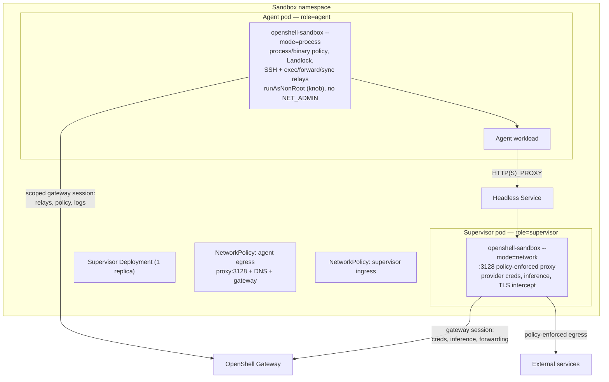
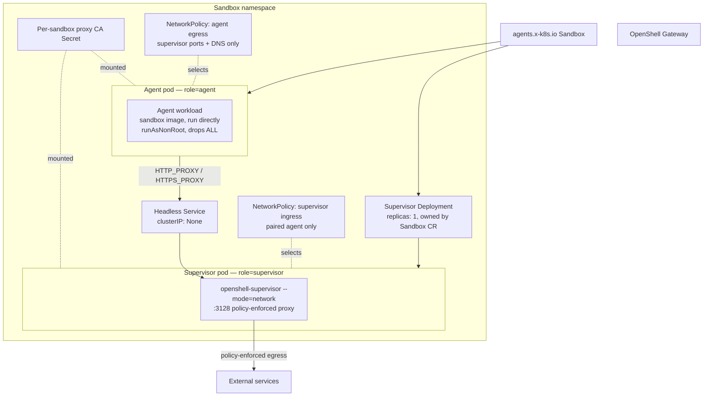

---
authors:
  - "@TaylorMutch"
  - "@russellb"
state: draft
links:
  - https://github.com/NVIDIA/OpenShell/pull/2077 - original proxy-pod topology PR from TaylorMutch
  - https://github.com/NVIDIA/OpenShell/pull/2074 - kubernetes combined topology
  - https://github.com/NVIDIA/OpenShell/pull/2076 - kubernetes sidecar topology
  - https://github.com/NVIDIA/OpenShell/pull/2078 - cni-sidecar topology
---

# RFC NNNN - Proxy-Pod Supervisor Topology (and OpenShift Enablement)

<!--
See rfc/README.md for the full RFC process and state definitions. This RFC is
intentionally unnumbered: a number is assigned by maintainers from the
originating issue before it moves out of draft.
-->

## Summary

This RFC proposes `proxy-pod`, a Kubernetes supervisor topology that moves the
**network proxy** out of the sandbox pod into a paired, per-sandbox supervisor
`Deployment`, while **keeping the process supervisor in the sandbox pod**. The
sandbox pod runs the OpenShell process supervisor (`--mode=process`) alongside
the workload, so filesystem policy, process/binary identity, SSH, `connect`,
`exec`, upload/download, file sync, and provider injection all keep working. Only
the credential-bearing L4/L7 network proxy lives in the separate pod. Egress is
confined by two per-sandbox Kubernetes `NetworkPolicy` objects rather than by
pod-local nftables rules, so the sandbox pod needs **no `NET_ADMIN`/`SYS_ADMIN`,
no privileged init container, no shared node component** — and, via a
privilege-drop knob copied from `cni-sidecar`, can run entirely non-root under a
stock SCC.

> **Revision note.** An earlier design of this RFC (retained below under
> [Superseded design](#superseded-design-network-only-no-in-pod-supervisor))
> moved the *entire* supervisor into the separate pod, leaving the sandbox pod
> with no supervisor at all. That maximized isolation but gave up SSH/exec/sync,
> filesystem/process policy, and provider injection — too much for most users.
> This revision keeps those features by leaving the process supervisor in the
> sandbox pod and moving only the network proxy out. The OpenShift enablement
> (DNS peers, `nonroot-v2` SCC), the `NetworkPolicy` fence, the companion
> `Deployment`/`Service`/`Secret` set, and the readiness/lifecycle machinery are
> all carried forward unchanged from that work; the changes are confined to what
> now runs in the sandbox pod and to the credential it holds.

Compared with the in-pod `sidecar`/`cni-sidecar` topologies, this delivers the
same interactive feature set with the network half in its own pod (its own
failure domain, its own Kata VM, and provider credentials never co-resident with
the workload) and confinement by `NetworkPolicy` instead of nftables — no
privileged init container and no node-level DaemonSet. The one new cost versus
the network-only design is that the sandbox pod again holds a gateway
credential; this RFC proposes **scoping that credential down** (a
process-supervisor `caller_kind` that cannot read provider secrets or mint
upstream credentials) so the sensitive capabilities stay only in the proxy pod.

The OpenShift enablement is validated against a live OpenShift 4.x /
OVN-Kubernetes cluster: configurable DNS egress peers (the hardcoded upstream
`kube-system`/port-53 selectors do not hold on OpenShift), and a gated
`nonroot-v2` grant rather than a custom SCC.

## Motivation

OpenShell's `combined` topology runs the full supervisor inside the agent
container, which requires that container to carry `SYS_ADMIN`, `NET_ADMIN`,
`SYS_PTRACE`, and `SYSLOG`. The `sidecar` topology moves network enforcement to
a dedicated sidecar and drops the agent container to no added capabilities, but
still needs a **privileged network init container** in every sandbox pod to
install the nftables fence. [`cni-sidecar`](./cni-sidecar-topology-DRAFT.md)
removes that init container by pushing rule installation to a node-level CNI
plugin, but it moves the privilege rather than eliminating it: the CNI DaemonSet
runs `privileged` with host-path writes, and the binary-aware sidecar still runs
as UID 0 with `SYS_PTRACE` and `DAC_READ_SEARCH`.

All three share an assumption: OpenShell's enforcement point lives inside the
sandbox pod, so the pod must be granted whatever privilege that enforcement
requires. Some clusters will not accept that at any level. Multi-tenant
platforms, regulated environments, and clusters with strict admission policy
often permit only the baseline restricted profile for tenant workloads — no
added capabilities, no root containers, no privileged init containers, no
host-path DaemonSets installed on their behalf. On those clusters OpenShell is
currently not deployable at all.

Such clusters do, however, almost always enforce `NetworkPolicy`, because that
is the tenant-isolation primitive their platform is already built on. If
OpenShell expresses its egress fence as `NetworkPolicy` instead of nftables, the
enforcement moves to machinery the cluster already runs and already trusts, and
the sandbox pod needs no privilege whatsoever.

The features that depend on the supervisor sharing the workload's namespaces —
filesystem policy, binary identity, and the interactive session paths — do **not**
have to be given up to get there. They only require the *process* supervisor to
share those namespaces; they do not require the *network* proxy to. So this RFC
keeps the process supervisor in the sandbox pod (exactly where `sidecar` keeps
it) and moves only the network proxy out. The sandbox pod still needs the modest
privileges the process supervisor uses (and a knob to drop them), but never the
network-setup privileges (`NET_ADMIN`/`SYS_ADMIN`/nftables) — those move to the
proxy pod, and the fence becomes `NetworkPolicy`. The result runs on clusters
that permit no in-pod *network* privilege while still delivering the full
interactive contract.

OpenShift is the concrete case driving this now. OpenShell's current OpenShift
guidance requires granting sandbox pods the `privileged` SCC and is documented
as experimental and evaluation-only. `cni-sidecar` improves on that but still
needs a custom SCC carrying `SYS_PTRACE` and `DAC_READ_SEARCH` plus
`runAsUser: RunAsAny`. `proxy-pod` needs neither: with the DNS fix proposed
below, it admits under the built-in, unmodified `nonroot-v2` SCC. That makes it
the first OpenShell topology that runs on OpenShift without a bespoke security
grant.

## Non-goals

- **Replacing `combined`, `sidecar`, or `cni-sidecar`.** All remain. `combined`
  stays the default and the only topology providing the full supervisor
  contract. `proxy-pod` is for clusters that cannot accept in-pod privilege.
- **Re-implementing the supervisor features.** Filesystem policy, process and
  binary controls, SSH/`connect`, `exec`, upload/download, sync, and provider
  injection are *preserved* by keeping the process supervisor in the sandbox pod
  — they reuse the existing `--mode=process` / `sidecar` code paths unchanged.
  This RFC does not build new implementations of them; it only relocates the
  network proxy and the fence.
- **A zero-supervisor sandbox pod.** Moving the *entire* supervisor out (the
  superseded design) is explicitly not the proposal; whether to retain it as a
  separate maximal-isolation variant is an open question.
- **Working without `NetworkPolicy` enforcement.** The topology has no fallback
  fence. On a cluster whose CNI ignores `NetworkPolicy`, the generated policies
  are declarative only and the workload can bypass the proxy freely. This RFC
  proposes failing loudly, not degrading quietly.
- **DNS-level exfiltration control.** The agent pod is permitted UDP/TCP 53 to
  cluster DNS so name resolution works. DNS tunnelling is not addressed here.
- **Installing or configuring a CNI.** This RFC consumes whatever
  `NetworkPolicy` implementation the cluster already runs.
- **Per-sandbox supervisor autoscaling or sharing.** The pairing is strictly
  1:1. A shared proxy serving many sandboxes is a different design.

## Proposed design: in-pod process supervisor, out-of-pod network proxy

This is the authoritative design. The [Superseded design](#superseded-design-network-only-no-in-pod-supervisor)
section that follows describes the earlier network-only variant; its
per-sandbox companion set, `NetworkPolicy` fence lifecycle, configurable DNS
peers, and OpenShift DNS analysis are all reused here and are not repeated. The
deltas below are what changes.

### Overview



The single `openshell-sandbox` binary already runs its network and process
halves independently by `--mode`; this is exactly the split `sidecar` uses, but
with the network half in a **separate pod** and the fence expressed as
`NetworkPolicy`. Crucially, **nothing crosses the pod boundary except workload
egress → proxy** (plain TCP + a trusted CA). The process supervisor stays whole
in the sandbox pod and owns its relays and gateway session **locally**, so none
of `sidecar`'s cross-container coupling (the peer-credentialed control socket,
the abstract SSH relay socket, the shared PID namespace, the loopback redirect)
is needed — those are the parts that would not survive a pod boundary, and this
design never reaches for them.

### What runs where

| | Agent pod (`role=agent`) | Supervisor pod (`role=supervisor`) |
|---|---|---|
| Process | `openshell-sandbox --mode=process` + workload | `openshell-sandbox --mode=network` |
| Enforces | filesystem/Landlock, process/binary identity, seccomp, privilege drop | L4/L7 network policy, TLS interception, credential injection, inference routing |
| Relays (SSH/exec/forward/sync) | **served locally** (has the workload's namespaces) | none |
| Gateway session | scoped process-supervisor session (see credential model) | full network session |
| Provider credentials | **never** | yes (isolated here) |
| Egress path | direct to gateway (session); workload children via `HTTP_PROXY` → proxy pod | policy-approved internet |
| Privilege | process caps (`SYS_PTRACE`,`DAC_READ_SEARCH`; `SETUID`/`SETGID` if root privilege-drop) — droppable via knob; **no `NET_ADMIN`/`SYS_ADMIN`** | non-root `proxy_uid`, drops `ALL` |

### Cross-pod egress transport

The workload's children reach the proxy the same way the network-only design
already does: injected `HTTP(S)_PROXY`/`NO_PROXY` env pointing at the paired
headless `Service` on `:3128`, plus the per-sandbox CA trust bundle. This is
advisory; the agent-egress `NetworkPolicy` is the real fence. A transparent
loopback redirect (as `sidecar` does with nftables) is deliberately **not** used,
because it would require `NET_ADMIN` in the sandbox pod — the privilege this
topology exists to avoid. The process supervisor therefore skips its own netns
creation (as it already does under `NETWORK_ENFORCEMENT_MODE`) and does not run
an in-pod proxy; a new enforcement-mode value selects "process supervisor +
remote proxy over the Service address," reusing the existing `PROXY_URL` /
`configured_proxy_url` plumbing.

### Credential model: a scoped process-supervisor credential

This is the one real regression versus the network-only design (where the
sandbox pod held no gateway identity at all), and the RFC proposes to bound it
tightly. The sandbox pod's process supervisor needs a gateway session for its
relays (`ConnectSupervisor`, `RelayStream`, `ReportMainProcessExit`), log push,
config read, and token refresh. The sandbox credential is already a
gateway-minted, Ed25519 **per-sandbox** JWT that can only act as its one sandbox
— no cross-sandbox, no cluster-wide, no admin RPC. But today its authority is a
fixed allowlist of all `sandbox`-callable RPCs, so it would also carry the two
capabilities the process supervisor does **not** need and that are the only
secret-bearing ones: `GetSandboxProviderEnvironment` (reads provider secrets) and
`ExchangeProviderSubjectToken` (mints upstream credentials), plus
`GetInferenceBundle` — all network-supervisor concerns.

The RFC proposes adding a **`caller_kind` claim** to the sandbox JWT (mirroring
the existing `ExtensionJwtClaims.caller_kind`), minting the agent-pod token as a
`process`-kind credential, and rejecting those three RPCs for that kind at the
existing authorization chokepoint plus per-handler guards. The result: a
compromised agent pod can relay into / report on / renew **its own** sandbox, but
**cannot read provider secrets or mint upstream credentials** — those stay
exclusively in the proxy pod (a separate pod, and under Kata a separate VM). It
cannot be made literally read-only (it must push its own logs, report its own
exit, and refresh its own token), but "own-sandbox, control-plane-minimal, no
provider/inference" is achievable and is the proposed target. The full-authority
token is still minted for the proxy pod's network session.

### NetworkPolicy delta

The supervisor-ingress policy is unchanged. The agent-egress fence gains one
peer: the **gateway endpoint**, because the in-pod process supervisor now opens
its own gateway session (the network-only design's agent pod never talked to the
gateway, so its fence allowed only proxy:3128 + DNS). This is a deliberate,
documented widening of the agent's egress surface. Everything else — deny by
default, proxy:3128, DNS peers — carries over.

### Privilege model and the drop knob

The sandbox pod needs only the **process** supervisor's privileges, never the
network-setup ones. It reuses the `cni-sidecar`/`sidecar` privilege-drop pattern
verbatim: a boolean knob (secure-by-default) where the strict mode runs the
process supervisor with `SYS_PTRACE` + `DAC_READ_SEARCH` (for cross-UID `/proc`
binary attribution) and — if the operator wants supervisor-managed root→sandbox
privilege drop — as root with `SETUID`/`SETGID`; the relaxed mode drops those
caps, runs non-root as the resolved sandbox UID, and downgrades to endpoint/L7
policy without `policy.binaries` matching (network enforcement is remote anyway).
`NET_ADMIN`/`NET_RAW`/`SYS_ADMIN` are never present in the sandbox pod under
either mode. The proxy pod is always non-root (`proxy_uid`, drops `ALL`).

### Session model and readiness

Unlike the network-only design, this topology **has** an in-sandbox supervisor
session, so it reports the `sidecar`/`combined` `SupervisorSessionModel`
(`REQUIRED`), relays are available, and readiness derives from the live process
supervisor session — not the `NONE` sessionless path. The separate proxy pod's
availability is still folded into readiness (a sandbox with a dead proxy is
`Provisioning`), reusing the network-only design's supervisor-`Deployment`
readiness watch + reconcile. The `wait-for-proxy` init container and the
companion lifecycle (create/reconcile/teardown, fence quiescence) carry over
unchanged.

### Feature availability vs. the alternatives

| Capability | `sidecar`/`cni-sidecar` | network-only `proxy-pod` (superseded) | **this design** |
|---|---|---|---|
| Network + L7 policy | yes | yes | yes |
| Filesystem / process / binary policy | yes | **no** | **yes** |
| SSH / `exec` / upload / sync | yes | **no** | **yes** |
| Provider injection | yes | **no** | **yes** |
| Workload output in `openshell logs` | yes | **no** | **yes** |
| Fence mechanism | nftables (in-pod) | `NetworkPolicy` | `NetworkPolicy` |
| Privileged init container / node DaemonSet | yes / (cni: yes) | no / no | **no / no** |
| Sandbox-pod network privilege (`NET_ADMIN`) | yes (init/sidecar) | none | **none** |
| Provider creds co-resident with workload | yes (same pod) | n/a | **no (separate pod/VM)** |
| Gateway credential in sandbox pod | yes (sidecar holds it) | **none** | scoped process-only |
| Pods per sandbox | 1 | 2 | 2 |

The niche this fills: **`sidecar`'s feature set, confined by `NetworkPolicy`
instead of nftables (no privileged init, no node DaemonSet), with the network
half — and all provider credentials — isolated in its own pod/VM.**

### OpenShift SCC implication (changed)

Because the sandbox pod now runs the process supervisor, the "admits under stock
`nonroot-v2`" property depends on the drop knob. In **relaxed** mode the sandbox
pod is non-root with `drop: [ALL]` and admits under `nonroot-v2` (or stock
`restricted-v2` if UIDs are SCC-assigned). In **strict** (binary-aware) mode it
needs the same minimal custom SCC `cni-sidecar`/`sidecar` use (adds
`SYS_PTRACE` + `DAC_READ_SEARCH`, and `RunAsAny` if root privilege-drop is kept).
The proxy pod continues to admit under `nonroot-v2`. The OpenShift DNS-peer and
`nonroot-v2` analysis below still applies to the proxy pod verbatim.

### Key tradeoffs to decide

1. **Credential placement (accepted).** The sandbox pod holds a scoped
   process-supervisor gateway credential. Recommended over the more complex
   alternative of brokering all gateway access through the proxy pod (which would
   re-introduce `sidecar`-style cross-pod relay bridging — the coupling this
   design avoids). Recorded as an open question.
2. **Enum shape.** Whether this replaces the `proxy-pod` value outright, or ships
   as a distinct value with the network-only design retained as a maximal
   isolation variant. Recommended: this becomes `proxy-pod`; retain the
   network-only path only if a concrete zero-in-pod-supervisor use case appears.

## Superseded design (network-only, no in-pod supervisor)

The sections below describe the earlier design that moved the entire supervisor
out of the sandbox pod. They are retained because most of their machinery — the
per-sandbox companion set, the `NetworkPolicy` fence and its lifecycle, the
configurable DNS peers, the OpenShift `nonroot-v2` analysis, and the
readiness/reconcile plumbing — is reused unchanged by the proposed design above.
Where a section describes the *sandbox pod running no supervisor* (privilege
model's agent row, credential isolation, "why relays cannot cross the pod
boundary," the network-only feature tables), it is superseded by the
corresponding subsection above.

### Topology overview



The key structural difference from every other topology: the supervisor is in a
**different pod, and therefore a different network namespace**. There is no
loopback to redirect to and no shared netns to install rules in, so the fence
cannot be nftables. It is `NetworkPolicy`, and that is the entire security
boundary.

### Per-sandbox resources

Creating one `proxy-pod` sandbox creates five OpenShell-managed objects
alongside the `Sandbox` CR, all in the sandbox namespace:

| Object | Name pattern | Purpose |
|---|---|---|
| `Deployment` | `os-sup-<name>-<hash>` | Runs the network supervisor, 1 replica |
| `Service` | `os-svc-<name>-<hash>` | Headless; agent's proxy endpoint |
| `Secret` | `os-ca-<name>-<hash>` | Per-sandbox generated proxy CA cert + key |
| `NetworkPolicy` | `os-eg-<name>-<hash>` | Agent egress fence |
| `NetworkPolicy` | `os-ing-<name>-<hash>` | Supervisor ingress restriction |

Names are `<prefix>-<sanitized-name>-<fnv32>` to stay within the 63-character
DNS label limit while remaining collision-resistant and human-recognizable.

The `Deployment` carries a **controlling** `Sandbox` ownerReference; the
`Service`, CA `Secret`, and supervisor-ingress `NetworkPolicy` carry
non-controlling ones. Kubernetes garbage collection reclaims those four when the
sandbox is deleted. The `Deployment` recreates the supervisor pod if it is
deleted independently.

The agent egress `NetworkPolicy` — the workload's egress fence — deliberately
carries **no** ownerReference. Owner-reference garbage collection does not order
sibling deletion, so a GC-owned fence would be removed concurrently with the
workload pod; a pod that ignores `SIGTERM` could then regain direct egress during
its termination grace period. Instead the gateway manages the fence's lifecycle
directly: it deletes the fence only after the workload pod is gone (the delete
path waits for the pod to disappear), and reconciliation reaps any fence orphaned
by a gateway crash (an `os-eg-*` policy whose Sandbox CR no longer exists). This
keeps the fence in place for exactly as long as the workload can still run.

Because the supervisor pod is created by a `Deployment`, its owner chain is
`Pod → ReplicaSet → Deployment → Sandbox` rather than `Pod → Sandbox`. Gateway
ServiceAccount bootstrap must walk that chain to authenticate the supervisor,
validating each link's UID, which is why the topology needs `apps/replicasets:
get` and `apps/deployments: get` in the sandbox `Role`. In shared
(single-namespace) mode the topology also watches supervisor Deployments to keep
readiness current, so the namespaced `Role` additionally grants
`apps/deployments: list` and `watch`. Managed and operator modes omit those verbs
from the `ClusterRole` — a cluster-wide Deployment informer would be broad
enumeration a compromised gateway could abuse — and fold readiness in through
get/list and the periodic reconcile instead.

### Privilege model

| Component | UID | Priv. escalation | Capabilities | Notes |
|---|---|---|---|---|
| Agent workload container | `sandbox_uid:sandbox_gid` | false | drops `ALL` | Runs the sandbox image's own entrypoint. No supervisor. |
| Proxy CA init container | `sandbox_uid:sandbox_gid` | false | drops `ALL`, `readOnlyRootFilesystem` | Builds the CA bundle into an `emptyDir`. |
| Workspace init container | `sandbox_uid:sandbox_gid` | false | drops `ALL` | Seeds the workspace PVC. Non-root, unlike other topologies. |
| Supervisor container | `proxy_uid:sandbox_gid` | false | drops `ALL` | Separate pod. Holds all gateway credentials. |

No container in either pod runs as root, requests a capability, or needs a
privileged init container, a shared process namespace, or a node-level
DaemonSet. This is the least-privileged configuration OpenShell produces.

### Credential isolation

The workload pod receives **no** gateway endpoint, bootstrap token, projected
ServiceAccount token, client TLS identity, or SPIFFE workload socket. It gets
only `HTTP_PROXY`/`HTTPS_PROXY` pointing at the paired Service, `NO_PROXY`, and
a CA trust bundle exposed through the environment variables the common runtimes
read (`SSL_CERT_FILE`, `REQUESTS_CA_BUNDLE`, `CURL_CA_BUNDLE`, `GIT_SSL_CAINFO`,
`NODE_EXTRA_CA_CERTS`, `DENO_CERT`).

Credential isolation here is structural rather than procedural. The `sidecar`
topology keeps credentials out of the agent container but must defend a shared
control socket with peer-credential checks and one-shot listener semantics.
`proxy-pod` has no such socket: the credential simply is not in the pod, and the
two pods share no namespace, no filesystem, and no IPC.

The workload also has no network path to the gateway. Only the supervisor
connects to the gateway (for policy, inference, log push, and token bootstrap);
the agent egress `NetworkPolicy` permits the workload to reach only the
supervisor's proxy port and cluster DNS. An earlier revision ran a raw TCP
forward from the supervisor to the gateway that the workload could reach; it was
removed because nothing on the workload consumed it and, under unauthenticated
gateway access, it was a policy-bypassing path to the gateway API.

One consequence: because credentials are per-supervisor and the CA is generated
per sandbox, a `proxy-pod` sandbox cannot participate in the corporate
upstream-proxy credential feature, which mounts a `user:pass` Secret into the
container performing network supervision. Mounting it into the workload pod
would defeat the purpose. This RFC proposes rejecting that combination at
configuration validation rather than silently mounting it in the wrong place.

Separate pods also raise the isolation ceiling under a VM-based `RuntimeClass`.
Kata Containers gives each *pod* its own lightweight VM and kernel; containers
within a pod share that VM. In every in-pod topology the workload and the
supervisor live in one pod, so a Kata VM escape — a kernel compromise inside
that shared VM — reaches the supervisor and its gateway credentials. Under
`proxy-pod` the workload and supervisor are separate pods and therefore separate
Kata VMs with separate kernels, so a kernel compromise in the workload VM does
not by itself reach the supervisor. This is unique to `proxy-pod`: it is the
only topology where the workload-to-supervisor boundary can be a hypervisor
boundary rather than a namespace boundary.

### The NetworkPolicy contract

Two policies define the fence:

**Agent egress** (`policyTypes: [Egress]`, selecting `sandbox-role=agent`) permits
exactly two destinations:

1. Pods labeled `sandbox-role=supervisor` for this sandbox ID, on TCP 3128 (the
   policy-enforced HTTP CONNECT proxy).
2. Cluster DNS, on UDP 53 and TCP 53.

Everything else is denied. **This is load-bearing.** `HTTP_PROXY` is only a
convention a workload may ignore; the egress policy is what makes ignoring it
useless. A cluster that does not enforce `NetworkPolicy` provides no fence at
all in this topology, which is why enforcement is a hard prerequisite and not a
recommendation.

**Supervisor ingress** (`policyTypes: [Ingress]`, selecting
`sandbox-role=supervisor`) accepts only from the paired agent pod on those same
two ports. Supervisor egress is deliberately unrestricted: it must reach the
gateway and the policy-approved internet, and OpenShell policy — not
`NetworkPolicy` — governs where.

The `sandbox-role` label selectors are scoped by sandbox ID, so two sandboxes in
one namespace cannot reach each other's supervisors.

### Cluster DNS peers must be configurable

The current implementation hardcodes the DNS peer as namespace
`kubernetes.io/metadata.name: kube-system` with pod labels `k8s-app: kube-dns`
or `k8s-app: coredns`. That encodes an upstream Kubernetes convention as if it
were a Kubernetes guarantee. It is not.

On OpenShift 4.x, verified against a live 4.22.6 / OVN-Kubernetes cluster:
`kube-system` contains no DNS pods at all. Cluster DNS runs in namespace
`openshift-dns` as DaemonSet `dns-default`, with pods labeled
`dns.operator.openshift.io/daemonset-dns=default`. The hardcoded selector matches
nothing, so the agent pod's DNS egress falls through to the policy's implicit
deny and **no name resolution works** — including resolving the paired
supervisor's own Service name. The sandbox is inert.

There is a second, subtler mismatch. A `NetworkPolicy` egress rule whose peer
is a `podSelector` is evaluated against the destination **pod** after `Service`
address translation, so its port list must name the DNS pods' *container* port.
Upstream `CoreDNS` listens on 53, so the Service port and container port
coincide and nobody notices. OpenShift's `dns-default` listens on **5353** and
maps 53 onto it, so a rule allowing port 53 matches nothing even with correct
selectors. This was confirmed empirically: with the right selectors but port
53, DNS failed both through the Service ClusterIP and directly against the DNS
pod IP; with 5353 it resolves.

This RFC therefore proposes a configurable DNS peer list carrying both
selectors and a port:

```toml
[openshell.drivers.kubernetes.proxy_pod]
proxy_uid = 1337
affinity = "disabled"          # disabled | preferred | required

# Cluster DNS peers for the agent egress NetworkPolicy. Defaults to the
# upstream kube-system/kube-dns and kube-system/coredns conventions on port 53.
[[openshell.drivers.kubernetes.proxy_pod.dns_peers]]
namespace_labels = { "kubernetes.io/metadata.name" = "openshift-dns" }
pod_labels = { "dns.operator.openshift.io/daemonset-dns" = "default" }
port = 5353
```

Each peer renders as its own egress rule, because a rule's port list applies to
every `to` entry in that rule and peers may listen on different ports.

with the Helm equivalent under `supervisor.proxyPod.dnsPeers`. When unset, the
existing upstream defaults apply, so no behavior changes for current users. Each
entry becomes one `to` peer in the egress rule; multiple entries are additive.

Configuration is the right shape rather than platform auto-detection: the driver
would otherwise need cluster-type inference and cluster-wide namespace or pod
read permissions it does not currently hold, and operators running NodeLocal
DNSCache or a non-default DNS deployment need the override regardless of
platform.

### OpenShift SCC model

OpenShift's `restricted-v2` SCC sets `runAsUser: MustRunAsRange` and
`fsGroup: MustRunAs`, admitting only UIDs inside the namespace's
`openshift.io/sa.scc.uid-range` annotation — on the verification cluster,
`1000000000/10000`. The driver assigns fixed UIDs (`sandbox_uid` default 1000,
`proxy_uid` default 1337), both far outside that range, so `restricted-v2`
rejects both pods.

The built-in **`nonroot-v2`** SCC resolves this without a custom SCC. It is
`restricted-v2` with `runAsUser: MustRunAsNonRoot` and `fsGroup: RunAsAny`,
keeping `requiredDropCapabilities: [ALL]`, `allowPrivilegeEscalation: false`,
`allowPrivilegedContainer: false`, no host namespaces, and
`seccompProfiles: [runtime/default]`. Its `allowedCapabilities` is
`[NET_BIND_SERVICE]` only, which `proxy-pod` does not use. Its volume allowlist
covers every volume type the topology needs: `emptyDir`, `secret`, `projected`,
`persistentVolumeClaim`, `csi`, and `configMap`.

`proxy-pod` therefore admits on OpenShift under an unmodified, Red Hat-shipped
SCC:

```shell
oc adm policy add-scc-to-user nonroot-v2 -z openshell-sandbox -n openshell
```

Measured on the validation cluster, the two pods land on *different* SCCs, and
only one needs the grant:

| Pod | Admitted under | UID | Why |
|---|---|---|---|
| Agent | `restricted-v2` | `1000810000` (SCC-assigned) | `sandbox_uid` is optional and was unset, so no explicit UID to reject |
| Supervisor | `nonroot-v2` | `1337` (explicit) | `proxy_pod.proxy_uid` always has a value, which `restricted-v2` rejects |

Both ran with `capabilities.drop: ["ALL"]`, `allowPrivilegeEscalation: false`,
and `seccompProfile: RuntimeDefault`.

This RFC proposes rendering that grant from the chart behind a gated value
(`sandboxServiceAccount.openshift.nonrootSCC`, default off, so non-OpenShift
installs never reference OpenShift-only APIs), mirroring how `cni-sidecar`
gates its SCC grants.

The comparison across topologies is the strongest argument for `proxy-pod` on
OpenShift:

| Topology | OpenShift SCC required |
|---|---|
| `combined` | `privileged` (current documented guidance, evaluation-only) |
| `sidecar` | custom SCC: `RunAsAny` + `SYS_PTRACE` + `DAC_READ_SEARCH` |
| `cni-sidecar` | custom sandbox SCC, plus `privileged` for the CNI DaemonSet |
| `proxy-pod` | built-in `nonroot-v2`, unmodified |

An alternative worth recording: the driver could omit `runAsUser`/`runAsGroup`/
`fsGroup` entirely on OpenShift and let SCC admission assign them from the
namespace range, which would admit under stock `restricted-v2` and require no
grant at all. The `proxy_uid != sandbox_uid` constraint exists to keep the
nftables fence from exempting the workload, and `proxy-pod` has no nftables
fence and no shared namespace, so the constraint is not security-relevant here.
This RFC does not propose it yet, because it interacts with workspace PVC
ownership and needs its own validation, but it is the natural follow-up and
would make `proxy-pod` zero-grant on OpenShift. The measurement above is direct
evidence that it would work: the agent pod already takes exactly this path.

### Same-node placement

`proxy_pod.affinity` controls pairing: `disabled` (default), `preferred`, or
`required`, matching the paired supervisor on `kubernetes.io/hostname` while
preserving any workload-supplied affinity terms. The default is off, which means
every workload byte crosses the pod network to another node. `preferred` is the
better operational default for latency-sensitive agents; `required` risks
unschedulable pairs under node pressure. The default is left at `disabled` in
this RFC but is a reasonable thing for reviewers to push back on.

### Readiness without a supervisor session

`SandboxPhase::Ready` was reachable only through a live `ConnectSupervisor`
session. That session is opened solely by `openshell-supervisor-process`, and
its `GatewayMessage` payload is relays — `RelayOpen`/`RelayClose` — plus session
control and heartbeats. So `Ready` has meant "the gateway can open relays into
this sandbox," which for `proxy-pod` will never be true and should not be.

Left alone, this made the topology unusable: on OpenShift both pods ran and
policy-enforced egress worked end to end while the sandbox reported
`Provisioning` indefinitely, and every `Ready`-gated RPC — including `stop` and
`start` — was unreachable.

This RFC proposes making the readiness contract explicit rather than implied. A
`SupervisorSessionModel` on `DriverSandboxStatus` lets a driver declare that a
sandbox has no in-sandbox process supervisor. `UNSPECIFIED` preserves the
existing behavior, so drivers that never set it are unaffected; the Kubernetes
driver reports `NONE` for `proxy-pod` and `REQUIRED` otherwise. The gateway then
derives readiness for such sandboxes from the backend conditions alone.

Two consequences fall out of that and are part of the proposal:

**Readiness must not become a lie.** With the session gate removed, `Ready`
follows the agent pod, which says nothing about whether the paired supervisor is
serving. A pod could be Ready with no egress path at all. The agent pod
therefore gains a `wait-for-proxy` init container that blocks until the paired
supervisor accepts connections on its proxy port, so pod readiness transitively
means egress works. This also closes a pre-existing ordering gap where the
workload could start before the proxy existed and its early requests simply
failed.

**Relay-backed RPCs must fail honestly.** Once such sandboxes reach `Ready`,
`exec`, `connect`, port forwarding, and file transfer would pass their readiness
checks and then wait out a session timeout that cannot succeed. The same
declaration lets the gateway reject them immediately with an error naming the
topology.

### Running a workload with no supervisor to launch it

`proxy-pod` runs the sandbox image directly. Nothing supplies a command: the
initial command from `openshell sandbox create -- <cmd>` is delivered over the
supervisor session as an exec/SSH session after `Ready`, which this topology
does not have, and `DriverSandboxTemplate` has no `command`/`args` field.

That is tolerable for images built to run a workload, but OpenShell's own
sandbox images use an interactive shell entrypoint. Under kubelet with no TTY it
reads EOF and exits 0, so the stock image produces a `CrashLoopBackOff` with
empty logs — verified on OpenShift, where only an image with a genuinely
long-running entrypoint stayed up.

This RFC proposes accepting `containers.agent.command` and
`containers.agent.args` through the Kubernetes driver's existing `driver_config`
passthrough, alongside `resources` and `volume_mounts`. That needs no public API
change and reuses the documented escape hatch for driver-specific settings. The
fields are rejected in `combined` and `sidecar`, where the driver replaces the
container command with the supervisor binary and an override would be accepted
and then silently dropped.

Adding `command`/`args` to the public `SandboxTemplate` remains the more
discoverable long-term answer, but it forces a semantic decision — the field is
genuinely inapplicable to topologies where the supervisor is the entrypoint — and
is deferred rather than resolved here.

### Why relays cannot cross the pod boundary

The relay protocol states the constraint directly: `RelayOpen`'s target is
"the target the supervisor should dial **inside the sandbox**." Every
relay-backed capability — SSH, `exec`, port forwarding, file transfer — is a
request to reach into the sandbox and connect to something. Three properties
make that impossible from a separate pod:

- **The SSH server exists only in the process supervisor.** `russh` is a
  dependency of `openshell-supervisor-process` and the gateway.
  `openshell-supervisor-network`, the only supervisor `proxy-pod` runs, has no
  SSH server at all.
- **Sessions must land in the workload's namespaces.** `ssh.rs` spawns PTY
  shells and pipe-execs that need the workload's PID, mount, and user
  namespaces, and for networking it calls `setns(fd, CLONE_NEWNET)` on a
  dedicated thread to enter the sandbox network namespace — otherwise
  connections reach the host loopback rather than the sandbox loopback where
  services listen. A supervisor in another pod holds none of those namespaces.
- **The `sidecar` bridge does not generalize.** In `sidecar` the network
  sidecar owns the gateway session but does not serve SSH itself; it bridges
  relays to a Linux abstract socket owned by the process supervisor in the
  agent container, verified by peer PID. That works only because both run in
  one pod.

SSHing into the supervisor pod would land a shell in the wrong container.

One nuance is worth recording, because it narrows the gap. `RelayOpen` also
carries a `TcpRelayTarget`, used for port forwarding and service exposure, and
that is *not* structurally impossible here: the supervisor pod can dial the
agent pod's IP, since this design restricts agent **egress** and supervisor
**ingress** but leaves agent ingress open. The obstacle is practical rather
than architectural — `connect_in_netns` exists precisely because workloads
usually bind `127.0.0.1`, which is unreachable across pods, so it would work
for services bound to `0.0.0.0` and fail otherwise. The current implementation
rejects all relays uniformly, which is correct and safe; restoring TCP relays
alone is possible later and is the strongest argument for giving
`SupervisorSessionModel` a capability list rather than treating relays as
all-or-nothing.

### Observability

Network-layer observability survives intact; anything requiring visibility
inside the workload's namespaces does not. Log push to the gateway is gated on
the sandbox ID and gateway endpoint rather than on topology, and the proxy pod
has both, so `openshell logs <sandbox>` carries `[sandbox]` lines as usual.
Confirmed on OpenShift:

```text
[sandbox] [OCSF] NET:OPEN  [MED] DENIED -(0) -> github.com:443 [engine:opa] [reason:network connections not allowed by policy]
[sandbox] [OCSF] CONFIG:LOADED [INFO] Acknowledged initial policy revision as loaded [version:1]
[sandbox] Flushed denial analysis to gateway proposals=2 summaries=2
```

| Signal | `proxy-pod` |
|---|---|
| `NET:*` allow/deny with policy engine and reason | full |
| `CONFIG:*` policy and inference-route changes | full |
| Activity summaries and denial analysis for the policy advisor | full |
| Gateway-side logs | full |
| Workload stdout/stderr | **container log only** (`kubectl logs`), never `openshell logs` |
| Process and binary attribution on network events | **none** |
| `PROCESS:*`, `SSH:*`, Landlock/filesystem events | **none** |

Two losses deserve emphasis. The workload's own output is no longer captured
by OpenShell at all: the workload is the container's PID 1 and no OpenShell
process shares that pod, so its output reaches only the container log. Anyone
driving OpenShell through the API rather than with cluster access cannot see it.

And network events carry no actor: the denial above reads `-(0)`, an empty
process name and PID 0. Binary-aware attribution requires reading
`/proc/<pid>` across the workload's PID namespace, which a separate pod cannot
do. Operators can therefore answer what was denied but not which process
attempted it, which removes `policy.binaries` as both an enforcement and a
forensic tool.

### Feature availability

#### Enforcement

| Capability | `combined` | `sidecar` | `cni-sidecar` | `proxy-pod` |
|---|---|---|---|---|
| Network endpoint + L7 policy | yes | yes | yes | yes |
| Enforcement mechanism | in-pod nftables | in-pod nftables | node CNI rules | **`NetworkPolicy`** |
| Filesystem policy | yes | partial (Landlock) | partial (Landlock) | **no** |
| Process / binary identity | yes | yes | yes | **no** |
| `policy.binaries` matching | yes | yes | yes | **no** — no actor attribution |
| Dynamic provider env injection | yes | yes | yes | **no** |

#### Session and file access

All relay-backed, and all requiring the workload's namespaces:

| Capability | `combined` | `sidecar` | `cni-sidecar` | `proxy-pod` |
|---|---|---|---|---|
| SSH / `connect` | yes | yes | yes | **no** — structurally impossible |
| `exec` | yes | yes | yes | **no** — structurally impossible |
| Upload / download / sync | yes | yes | yes | **no** — structurally impossible |
| Port forwarding / service exposure | yes | yes | yes | **no today** — recoverable for `0.0.0.0` binds |
| Initial command from `sandbox create -- <cmd>` | yes | yes | yes | **no** — use `containers.agent.command` |

#### Observability

| Signal | `combined` | `sidecar` | `cni-sidecar` | `proxy-pod` |
|---|---|---|---|---|
| `NET:*` allow/deny with reason | yes | yes | yes | yes |
| `CONFIG:*` policy and route changes | yes | yes | yes | yes |
| Denial analysis for the policy advisor | yes | yes | yes | yes |
| Workload stdout/stderr in `openshell logs` | yes | yes | yes | **no** — only in the `agent` container log via `kubectl logs <agent-pod>` |
| Actor process on network events | yes | yes | yes | **no** — renders as `-(0)` |
| `PROCESS:*` lifecycle events | yes | yes | yes | **no** |
| `SSH:*` events | yes | yes | yes | **no** |
| Landlock / filesystem events | yes | partial | partial | **no** |

#### Operational posture

| Property | `combined` | `sidecar` | `cni-sidecar` | `proxy-pod` |
|---|---|---|---|---|
| Privileged init container | no | **yes** | no | no |
| Added capabilities in sandbox pod | **yes** | no | no | no |
| Node-level privileged DaemonSet | no | no | **yes** | no |
| Requires `NetworkPolicy` enforcement | no | no | no | **yes** |
| Pods per sandbox | 1 | 1 | 1 | **2** |
| Workload/supervisor kernel isolation under Kata | no — one pod, one VM/kernel | no — one pod, one VM/kernel | no — one pod, one VM/kernel | **yes — separate pods, separate Kata VMs/kernels** |
| OpenShift SCC required | `privileged` | custom | custom + `privileged` CNI | **built-in `nonroot-v2`** |

The dividing line is consistent: everything observable or enforceable at the
network boundary survives, and everything needing visibility inside the
workload's namespaces does not. `proxy-pod` suits batch and autonomous agent
workloads that need policy-enforced egress, ship their own long-running
entrypoint, and never need a human on the other end. Operators who want the
interactive workflow *and* low pod privilege should use `cni-sidecar`, which
keeps the full supervisor contract at the cost of a custom SCC and a
node-level DaemonSet. The two are complementary, not competing.

## Implementation plan

### In-pod process supervisor pivot (proposed direction)

The network-only work below (Phases 1–5) landed the companion set, the
`NetworkPolicy` fence, OpenShift enablement, readiness/reconcile, and lifecycle —
all reused as-is. The pivot builds on that:

- **P1 — Supervisor runtime.** A new `SUPERVISOR_TOPOLOGY`/`NETWORK_ENFORCEMENT_MODE`
  value that runs `--mode=process` in the agent pod with `ProcessEnforcementMode`
  selectable (Full vs relaxed), its own gateway session (policy/logs/relays), and
  child egress pointed at the remote proxy `Service` via `HTTP(S)_PROXY` (reuse
  `PROXY_URL`/`configured_proxy_url`); skip in-pod netns/nftables.
- **P2 — Scoped credential.** Add `caller_kind` to `SandboxJwtClaims`; mint the
  agent-pod token as `process`-kind; reject `GetSandboxProviderEnvironment`,
  `ExchangeProviderSubjectToken`, `GetInferenceBundle` for that kind at the
  `multiplex` chokepoint + per-handler guards. Back-compat: absent `caller_kind`
  = full authority.
- **P3 — Driver topology.** Render the agent pod as the `sidecar` `--mode=process`
  container **retaining** gateway creds (SA token/client-TLS/SPIFFE/endpoint) +
  proxy CA trust + `wait-for-proxy` init; render the proxy pod from the existing
  `proxy_pod_supervisor_deployment`/companions; add the gateway-egress rule to the
  agent-egress `NetworkPolicy`; thread the new topology through the ~30 match/gate
  sites with **sidecar-like** session model and **proxy-pod-like** companion
  lifecycle.
- **P4 — Privilege-drop knob + SCC.** Reuse the `cni-sidecar` pattern (config
  field + effective-UID helper + capability branch + optional minimal SCC).
- **P5 — Docs, tests, e2e, cluster validation.** Topology/OpenShift/gateway-config
  docs; unit + helm tests; extend the `proxy_pod` e2e suite to assert the
  recovered features (exec/sync work) and the scoped credential; validate on the
  OVN-Kubernetes cluster.

### Prior work (network-only design)

**Phase 1 — rebase and correctness (done).** Rebase PR #2077 onto current
`main`. Resolve the drift from multi-namespace gateway support (thread namespace
through the supervisor owner-chain walk and the cleanup path) and from the
corporate upstream-proxy feature (reject `proxy-pod` with proxy credential
Secrets at config validation, fail-closed).

**Phase 2 — pre-OpenShift fixes.** Configurable `dns_peers` with upstream
defaults. Supervisor `Deployment` lifecycle on `stop_sandbox`, which currently
leaves the supervisor running and billable while the sandbox is stopped. Chart
plumbing and unit coverage for both.

**Phase 3 — OpenShift enablement (validated).** Gated `nonroot-v2` grant in the
chart, then deployed to OpenShift 4.22.6 / OVN-Kubernetes. Measured results:

| Check | Result |
|---|---|
| All five per-sandbox resources created | pass |
| Supervisor pod admitted and running | pass, under `nonroot-v2`, UID 1337 |
| Agent pod admitted and running | pass, under stock `restricted-v2`, SCC-assigned UID |
| DNS resolves from the agent pod | pass, only after the 5353 port fix |
| Agent resolves its paired supervisor `Service` | pass |
| Direct egress to the internet denied | pass |
| Direct egress to the gateway denied | pass |
| Egress to supervisor `:3128` allowed | pass |
| Policy-denied host through the proxy | pass, 403 at CONNECT |
| Policy-allowed host through the proxy | pass, HTTP 200 with the generated CA trusted |
| All resources reclaimed on delete | pass |
| Sandbox reaches `Ready` | pass, after the `SupervisorSessionModel` change |
| `wait-for-proxy` init container gates pod readiness | pass |
| Relay RPCs rejected with a topology error | pass, 43ms rather than a timeout |
| `sandbox stop` scales the supervisor to zero | pass |
| `sandbox start` scales it back and returns to service | pass |
| Stock sandbox image runs via `containers.agent.command` | pass, previously `CrashLoopBackOff` |

Cluster testing also caught a bug the unit tests could not: the stop, start,
and delete paths derived per-sandbox resource names from the `Sandbox` CR name
rather than the sandbox name, which differ (`default--rdy` versus `rdy`). The
scale-down silently patched a Deployment that does not exist, and delete was
affected too but owner-reference garbage collection reclaimed the resources and
hid it.

The remaining work is documenting the OpenShift path in
`docs/kubernetes/openshift.mdx`.

**Phase 4 — test strategy.** The branch adds `mise run e2e:kubernetes:proxy-pod`,
but its `PROXY_POD_E2E` flag currently only prints warnings — it gates nothing.
The full Kubernetes e2e suite runs unchanged, and much of it drives sandboxes
through `exec`, SSH, upload, and sync, which this topology removes by design. A
run would fail broadly on absent capabilities and produce no signal about the
fence. `proxy-pod` needs a capability-scoped suite asserting what the topology
actually promises: egress denial, proxied egress, DNS, CA trust, and resource
GC. The capability-scoped `proxy_pod` suite now exists (`mise run
e2e:kubernetes:proxy-pod`) and runs in branch CI as `kubernetes-proxy-pod-e2e`.
Because CI's kind cluster uses a non-enforcing CNI, that job exercises the
control-plane contract — companion creation, readiness, and sessionless relay
rejection — but not the CNI-enforced egress isolation. The enforcement assertions
(egress denial and proxied egress) still need a policy-enforcing CNI in CI and
remain tracked as follow-up.

**Phase 5 — graduation.** Ship experimental. Graduate once the scoped suite's
enforcement assertions run in CI on at least one policy-enforcing CNI, and the
OpenShift path is validated end to end.

## Risks

**Silent loss of enforcement on a non-enforcing CNI.** The highest-severity
risk. If `NetworkPolicy` is not enforced, the generated policies are inert, the
workload can route around the proxy, and everything still *looks* healthy —
pods run, the supervisor is ready, sandboxes report available. There is no
in-band signal. Mitigation should be active rather than documentary: a startup
probe that verifies a denied egress path is actually denied, failing the sandbox
if the fence is not real. Documentation alone is insufficient for a control
whose failure mode is invisible. This active negative-egress probe (and the
CI coverage on a policy-enforcing CNI that would exercise it) is still
outstanding and tracked as follow-up.

**Supervisor liveness after startup.** A related but distinct failure: the
supervisor Deployment becoming unavailable *after* the sandbox reaches Ready.
The workload's `wait-for-proxy` init container only gates startup, and the agent
pod's own Ready condition cannot see the separate supervisor. This is now
mitigated: the driver folds supervisor Deployment availability into sandbox
status, so a sandbox whose supervisor has no available replica falls back to
`Provisioning` (Ready condition `False`, transient reason
`DependenciesNotReady`) rather than staying Ready with a dead egress path, and
recovers to `Ready` once the supervisor Deployment is available again. The driver
watches supervisor Deployments and pushes a refreshed status within seconds of an
availability change, so readiness does not lag behind the supervisor until the
next query or reconcile sweep; `get`/`list` queries and the periodic reconcile
fold in the same check as a backstop.

**Confused-deputy via image-baked launch environment.** In `combined` topology
the supervisor shares the workload's container and inherits the workload image's
environment. Honoring image-baked `OPENSHELL_PROXY_BIND_ADDR` or
`OPENSHELL_PROXY_CA_*` there would let an untrusted image publish the
credential-bearing policy proxy on the pod network or substitute an attacker CA.
This is now mitigated: those launch variables are honored only by a standalone
network supervisor (`proxy-pod`/`sidecar`, which runs the trusted supervisor
image in a separate container); a combined supervisor ignores them, binding to
the namespace-scoped veth IP and generating an ephemeral CA.

**Feature-set surprise.** An operator selecting `proxy-pod` for its security
properties may not anticipate that `openshell sandbox exec` and `connect` simply
stop working. The gateway should reject those RPCs for `proxy-pod` sandboxes
with an actionable error naming the topology, rather than failing obscurely.
This is now the behavior: relay-backed RPCs are rejected immediately with an
error naming the topology and pointing at `combined` or `sidecar`.

**Resource multiplication.** Every sandbox becomes two pods plus three
supporting objects. At scale this doubles pod count, doubles scheduling
pressure, and adds five API objects per sandbox. Namespaces with pod quotas will
hit them at half the expected sandbox count.

**Cross-node data path.** With affinity `disabled`, all workload egress crosses
the pod network. This adds latency to every request and makes the network path a
new failure mode that in-pod topologies do not have.

**Per-sandbox CA key at rest.** Each sandbox generates a CA cert and private key
stored in a Kubernetes `Secret`. Anyone who can read Secrets in the sandbox
namespace can mint certificates that the workload will trust. The blast radius
is one sandbox, but it is a new key-at-rest surface that other topologies do not
create.

**DNS as an open egress channel.** UDP/TCP 53 to cluster DNS is permitted and
unfiltered by OpenShell policy, leaving a DNS tunnelling path out of an
otherwise closed pod.

**Supervisor restart decoupling.** The `Deployment` recreates the supervisor pod
independently of the agent pod. Unlike `sidecar`, where symmetric exit
guarantees a matched pair, an agent pod here can outlive its supervisor and
continue running with all egress denied until the replacement becomes ready.

## Alternatives

### Do nothing

Clusters that permit no in-pod privilege remain unable to run OpenShell. On
OpenShift specifically, the documented path stays `privileged`-SCC and
evaluation-only.

### Shared proxy for many sandboxes

One supervisor `Deployment` per namespace instead of per sandbox would cut the
resource multiplication substantially. Rejected: policy is per sandbox, and a
shared proxy would need in-band sandbox attribution on every connection to
enforce the right policy, reintroducing a trust problem that 1:1 pairing avoids
structurally.

### Sidecar container in the same pod, without the nftables fence

Keeps one pod and removes the privileged init container, but without a fence the
workload reaches the network directly through the shared namespace and the proxy
becomes advisory. `NetworkPolicy` cannot help, because it cannot distinguish
containers within one pod. The separate pod is what makes the policy fence
expressible.

### Rely on an admission webhook to inject proxy settings

Moves configuration out of the driver but does not create a fence, and adds a
cluster-wide mutating webhook — often a harder sell than the workload permissions
it would replace.

### Custom OpenShift SCC, as `cni-sidecar` uses

Unnecessary here. `nonroot-v2` already grants exactly what `proxy-pod` needs.
Shipping a custom SCC when a built-in one suffices adds a cluster-scoped object
and an audit burden for no gain.

### Auto-detect the DNS peers instead of configuring them

Requires cluster-type inference plus cluster-wide namespace and pod read
permissions the driver does not hold, and still fails for NodeLocal DNSCache and
non-default DNS deployments. Configuration handles every case with no new RBAC.

## Prior art

- `combined`, `sidecar` (#2074, #2076) and `cni-sidecar`
  ([RFC](./cni-sidecar-topology-DRAFT.md), #2078) — the in-pod topologies this
  one departs from.
- Istio and Linkerd sidecar injection with `NetworkPolicy`-backed mesh
  isolation: same reliance on the CNI enforcing policy, same
  privilege-versus-enforcement tradeoff, and a comparable ambient/sidecar split.
- Kubernetes egress gateways (Cilium, Calico), which likewise centralize
  policy-enforced egress outside the workload pod.

## Open questions

- **Credential placement.** The proposed design puts a scoped process-supervisor
  credential in the sandbox pod. Is the `caller_kind` scoping (no
  provider/inference) sufficient, or is it worth the extra complexity of brokering
  all gateway access through the proxy pod so the sandbox pod holds no gateway
  credential at all (at the cost of re-introducing cross-pod relay bridging)?
- **Enum shape.** Should the in-pod-process-supervisor design replace the
  `proxy-pod` value, or ship as a distinct topology with the network-only
  (zero-in-pod-supervisor) design retained as a separate maximal-isolation
  variant? If distinct, what are they named?
- Should a startup fence-verification probe be a **requirement** for graduating
  `proxy-pod` out of experimental, given that the failure mode of a
  non-enforcing CNI is silent?
- Should `command`/`args` graduate from the Kubernetes `driver_config`
  passthrough to the public `SandboxTemplate`, and if so what do they mean in
  topologies where the supervisor is the container entrypoint?
- Should `openshell sandbox create -- <cmd>` be reinterpreted as the container
  command in topologies with no session, rather than failing to deliver it?
- Should OpenShell publish a `proxy-pod`-suitable sandbox image with a
  long-running entrypoint, so the default path works without `driver_config`?
- Should a future `SupervisorSessionModel` variant carry a capability list, so
  the gateway can gate individual RPCs rather than treating relays as
  all-or-nothing?
- Should `affinity` default to `preferred` rather than `disabled`, given that
  the default sends all workload egress across nodes?
- Should the gateway reject `exec`/`connect`/`upload`/`sync` for `proxy-pod`
  sandboxes at the RPC boundary with a topology-specific error?
- Should the driver drop explicit `runAsUser`/`runAsGroup`/`fsGroup` on
  OpenShift so `proxy-pod` admits under stock `restricted-v2` with no SCC grant
  at all, and what does that imply for workspace PVC ownership?
- Is per-sandbox CA generation the right model, or should the CA be issued by
  the gateway and distributed, so the private key never rests in a namespace the
  operator's tenants may be able to read?
