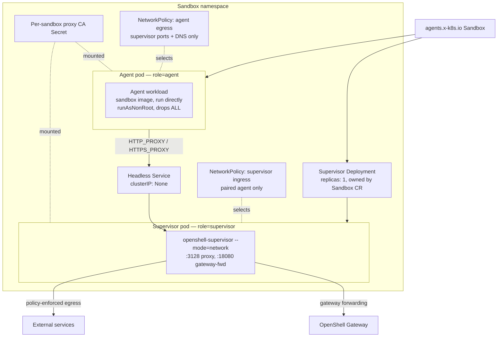

---
authors:
  - "@TaylorMutch"
  - "@russellb"
state: draft
links:
  - https://github.com/NVIDIA/OpenShell/pull/2077 - original proxy-pod topology PR from TaylorMutch
  - https://github.com/NVIDIA/OpenShell/pull/2074 - kubernetes combined topology
  - https://github.com/NVIDIA/OpenShell/pull/2076 - kubernetes sidecar topology
  - https://github.com/NVIDIA/OpenShell/pull/2078 - cni-sidecar topology
---

# RFC NNNN - Proxy-Pod Supervisor Topology (and OpenShift Enablement)

<!--
See rfc/README.md for the full RFC process and state definitions. This RFC is
intentionally unnumbered: a number is assigned by maintainers from the
originating issue before it moves out of draft.
-->

## Summary

This RFC proposes `proxy-pod`, a Kubernetes supervisor topology that moves
network enforcement and gateway forwarding out of the sandbox pod entirely and
into a paired, per-sandbox supervisor `Deployment`. The sandbox pod runs the
agent image directly — no supervisor binary, no gateway credentials, no
privileged init container, no shared process namespace. Egress is fenced by two
per-sandbox Kubernetes `NetworkPolicy` objects rather than by pod-local nftables
rules.

The tradeoff is explicit and large: `proxy-pod` is a **network-only** topology.
Filesystem policy, process and binary identity controls, SSH, `connect`, `exec`,
upload/download, file sync, and dynamic provider environment injection are all
unavailable, because there is no OpenShell supervisor in the workload pod. In
exchange, the sandbox pod's security context reduces to `runAsNonRoot` with all
Linux capabilities dropped, which is the least-privileged sandbox pod any
OpenShell topology produces.

The RFC also proposes the changes needed to run this topology on OpenShift, all
validated against a live OpenShift 4.22 / OVN-Kubernetes cluster. Two were
required and unmet by the original implementation: the DNS egress peers in the
generated `NetworkPolicy` are hardcoded to upstream Kubernetes conventions —
both the namespace/pod selectors and the port — that do not hold on OpenShift,
and the driver's explicit non-root proxy UID is rejected by the `restricted-v2`
SCC. The first needs a configuration surface; the second is satisfied by the
built-in `nonroot-v2` SCC and needs a gated Helm grant, not a custom SCC.

Validation confirmed the security model works as designed on OpenShift —
unproxied egress denied, proxied egress policy-evaluated, resources
garbage-collected — and surfaced two usability gaps that block adoption: the
user-supplied workload command is silently discarded, and sandboxes never leave
the `Provisioning` phase.

## Motivation

OpenShell's `combined` topology runs the full supervisor inside the agent
container, which requires that container to carry `SYS_ADMIN`, `NET_ADMIN`,
`SYS_PTRACE`, and `SYSLOG`. The `sidecar` topology moves network enforcement to
a dedicated sidecar and drops the agent container to no added capabilities, but
still needs a **privileged network init container** in every sandbox pod to
install the nftables fence. [`cni-sidecar`](./cni-sidecar-topology-DRAFT.md)
removes that init container by pushing rule installation to a node-level CNI
plugin, but it moves the privilege rather than eliminating it: the CNI DaemonSet
runs `privileged` with host-path writes, and the binary-aware sidecar still runs
as UID 0 with `SYS_PTRACE` and `DAC_READ_SEARCH`.

All three share an assumption: OpenShell's enforcement point lives inside the
sandbox pod, so the pod must be granted whatever privilege that enforcement
requires. Some clusters will not accept that at any level. Multi-tenant
platforms, regulated environments, and clusters with strict admission policy
often permit only the baseline restricted profile for tenant workloads — no
added capabilities, no root containers, no privileged init containers, no
host-path DaemonSets installed on their behalf. On those clusters OpenShell is
currently not deployable at all.

Such clusters do, however, almost always enforce `NetworkPolicy`, because that
is the tenant-isolation primitive their platform is already built on. If
OpenShell expresses its egress fence as `NetworkPolicy` instead of nftables, the
enforcement moves to machinery the cluster already runs and already trusts, and
the sandbox pod needs no privilege whatsoever.

The cost is that a supervisor outside the pod cannot supervise processes inside
it. Filesystem policy, binary identity, and the interactive session paths all
depend on the supervisor sharing the workload's namespaces. `proxy-pod` gives
those up deliberately. It is the right choice when the alternative is not a
richer topology but no OpenShell at all.

OpenShift is the concrete case driving this now. OpenShell's current OpenShift
guidance requires granting sandbox pods the `privileged` SCC and is documented
as experimental and evaluation-only. `cni-sidecar` improves on that but still
needs a custom SCC carrying `SYS_PTRACE` and `DAC_READ_SEARCH` plus
`runAsUser: RunAsAny`. `proxy-pod` needs neither: with the DNS fix proposed
below, it admits under the built-in, unmodified `nonroot-v2` SCC. That makes it
the first OpenShell topology that runs on OpenShift without a bespoke security
grant.

## Non-goals

- **Replacing `combined`, `sidecar`, or `cni-sidecar`.** All remain. `combined`
  stays the default and the only topology providing the full supervisor
  contract. `proxy-pod` is for clusters that cannot accept in-pod privilege.
- **Restoring the removed supervisor features.** Filesystem policy, process and
  binary controls, SSH/`connect`, `exec`, upload/download, sync, and dynamic
  provider injection are out of scope for this topology by construction. A
  RuntimeClass does not restore them.
- **Working without `NetworkPolicy` enforcement.** The topology has no fallback
  fence. On a cluster whose CNI ignores `NetworkPolicy`, the generated policies
  are declarative only and the workload can bypass the proxy freely. This RFC
  proposes failing loudly, not degrading quietly.
- **DNS-level exfiltration control.** The agent pod is permitted UDP/TCP 53 to
  cluster DNS so name resolution works. DNS tunnelling is not addressed here.
- **Installing or configuring a CNI.** This RFC consumes whatever
  `NetworkPolicy` implementation the cluster already runs.
- **Per-sandbox supervisor autoscaling or sharing.** The pairing is strictly
  1:1. A shared proxy serving many sandboxes is a different design.

## Proposal

### Topology overview



The key structural difference from every other topology: the supervisor is in a
**different pod, and therefore a different network namespace**. There is no
loopback to redirect to and no shared netns to install rules in, so the fence
cannot be nftables. It is `NetworkPolicy`, and that is the entire security
boundary.

### Per-sandbox resources

Creating one `proxy-pod` sandbox creates five OpenShell-managed objects
alongside the `Sandbox` CR, all in the sandbox namespace:

| Object | Name pattern | Purpose |
|---|---|---|
| `Deployment` | `os-sup-<name>-<hash>` | Runs the network supervisor, 1 replica |
| `Service` | `os-svc-<name>-<hash>` | Headless; agent's proxy endpoint |
| `Secret` | `os-ca-<name>-<hash>` | Per-sandbox generated proxy CA cert + key |
| `NetworkPolicy` | `os-eg-<name>-<hash>` | Agent egress fence |
| `NetworkPolicy` | `os-ing-<name>-<hash>` | Supervisor ingress restriction |

Names are `<prefix>-<sanitized-name>-<fnv32>` to stay within the 63-character
DNS label limit while remaining collision-resistant and human-recognizable.

The `Deployment` carries a **controlling** `Sandbox` ownerReference; the other
four carry non-controlling ones. Kubernetes garbage collection therefore reclaims
all five when the sandbox is deleted, and the driver additionally deletes them
explicitly on the delete path so teardown does not wait on the GC controller. The
`Deployment` recreates the supervisor pod if it is deleted independently.

Because the supervisor pod is created by a `Deployment`, its owner chain is
`Pod → ReplicaSet → Deployment → Sandbox` rather than `Pod → Sandbox`. Gateway
ServiceAccount bootstrap must walk that chain to authenticate the supervisor,
validating each link's UID, which is why the topology needs `apps/replicasets:
get` and `apps/deployments: get` in the sandbox `Role`.

### Privilege model

| Component | UID | Priv. escalation | Capabilities | Notes |
|---|---|---|---|---|
| Agent workload container | `sandbox_uid:sandbox_gid` | false | drops `ALL` | Runs the sandbox image's own entrypoint. No supervisor. |
| Proxy CA init container | `sandbox_uid:sandbox_gid` | false | drops `ALL`, `readOnlyRootFilesystem` | Builds the CA bundle into an `emptyDir`. |
| Workspace init container | `sandbox_uid:sandbox_gid` | false | drops `ALL` | Seeds the workspace PVC. Non-root, unlike other topologies. |
| Supervisor container | `proxy_uid:sandbox_gid` | false | drops `ALL` | Separate pod. Holds all gateway credentials. |

No container in either pod runs as root, requests a capability, or needs a
privileged init container, a shared process namespace, or a node-level
DaemonSet. This is the least-privileged configuration OpenShell produces.

### Credential isolation

The workload pod receives **no** gateway endpoint, bootstrap token, projected
ServiceAccount token, client TLS identity, or SPIFFE workload socket. It gets
only `HTTP_PROXY`/`HTTPS_PROXY` pointing at the paired Service, `NO_PROXY`, and
a CA trust bundle exposed through the environment variables the common runtimes
read (`SSL_CERT_FILE`, `REQUESTS_CA_BUNDLE`, `CURL_CA_BUNDLE`, `GIT_SSL_CAINFO`,
`NODE_EXTRA_CA_CERTS`, `DENO_CERT`).

Credential isolation here is structural rather than procedural. The `sidecar`
topology keeps credentials out of the agent container but must defend a shared
control socket with peer-credential checks and one-shot listener semantics.
`proxy-pod` has no such socket: the credential simply is not in the pod, and the
two pods share no namespace, no filesystem, and no IPC.

One consequence: because credentials are per-supervisor and the CA is generated
per sandbox, a `proxy-pod` sandbox cannot participate in the corporate
upstream-proxy credential feature, which mounts a `user:pass` Secret into the
container performing network supervision. Mounting it into the workload pod
would defeat the purpose. This RFC proposes rejecting that combination at
configuration validation rather than silently mounting it in the wrong place.

### The NetworkPolicy contract

Two policies define the fence:

**Agent egress** (`policyTypes: [Egress]`, selecting `sandbox-role=agent`) permits
exactly two destinations:

1. Pods labeled `sandbox-role=supervisor` for this sandbox ID, on TCP 3128 and
   TCP 18080.
2. Cluster DNS, on UDP 53 and TCP 53.

Everything else is denied. **This is load-bearing.** `HTTP_PROXY` is only a
convention a workload may ignore; the egress policy is what makes ignoring it
useless. A cluster that does not enforce `NetworkPolicy` provides no fence at
all in this topology, which is why enforcement is a hard prerequisite and not a
recommendation.

**Supervisor ingress** (`policyTypes: [Ingress]`, selecting
`sandbox-role=supervisor`) accepts only from the paired agent pod on those same
two ports. Supervisor egress is deliberately unrestricted: it must reach the
gateway and the policy-approved internet, and OpenShell policy — not
`NetworkPolicy` — governs where.

The `sandbox-role` label selectors are scoped by sandbox ID, so two sandboxes in
one namespace cannot reach each other's supervisors.

### Cluster DNS peers must be configurable

The current implementation hardcodes the DNS peer as namespace
`kubernetes.io/metadata.name: kube-system` with pod labels `k8s-app: kube-dns`
or `k8s-app: coredns`. That encodes an upstream Kubernetes convention as if it
were a Kubernetes guarantee. It is not.

On OpenShift 4.x, verified against a live 4.22.6 / OVN-Kubernetes cluster:
`kube-system` contains no DNS pods at all. Cluster DNS runs in namespace
`openshift-dns` as DaemonSet `dns-default`, with pods labeled
`dns.operator.openshift.io/daemonset-dns=default`. The hardcoded selector matches
nothing, so the agent pod's DNS egress falls through to the policy's implicit
deny and **no name resolution works** — including resolving the paired
supervisor's own Service name. The sandbox is inert.

There is a second, subtler mismatch. A `NetworkPolicy` egress rule whose peer
is a `podSelector` is evaluated against the destination **pod** after `Service`
address translation, so its port list must name the DNS pods' *container* port.
Upstream `CoreDNS` listens on 53, so the Service port and container port
coincide and nobody notices. OpenShift's `dns-default` listens on **5353** and
maps 53 onto it, so a rule allowing port 53 matches nothing even with correct
selectors. This was confirmed empirically: with the right selectors but port
53, DNS failed both through the Service ClusterIP and directly against the DNS
pod IP; with 5353 it resolves.

This RFC therefore proposes a configurable DNS peer list carrying both
selectors and a port:

```toml
[openshell.drivers.kubernetes.proxy_pod]
proxy_uid = 1337
affinity = "disabled"          # disabled | preferred | required

# Cluster DNS peers for the agent egress NetworkPolicy. Defaults to the
# upstream kube-system/kube-dns and kube-system/coredns conventions on port 53.
[[openshell.drivers.kubernetes.proxy_pod.dns_peers]]
namespace_labels = { "kubernetes.io/metadata.name" = "openshift-dns" }
pod_labels = { "dns.operator.openshift.io/daemonset-dns" = "default" }
port = 5353
```

Each peer renders as its own egress rule, because a rule's port list applies to
every `to` entry in that rule and peers may listen on different ports.

with the Helm equivalent under `supervisor.proxyPod.dnsPeers`. When unset, the
existing upstream defaults apply, so no behavior changes for current users. Each
entry becomes one `to` peer in the egress rule; multiple entries are additive.

Configuration is the right shape rather than platform auto-detection: the driver
would otherwise need cluster-type inference and cluster-wide namespace or pod
read permissions it does not currently hold, and operators running NodeLocal
DNSCache or a non-default DNS deployment need the override regardless of
platform.

### OpenShift SCC model

OpenShift's `restricted-v2` SCC sets `runAsUser: MustRunAsRange` and
`fsGroup: MustRunAs`, admitting only UIDs inside the namespace's
`openshift.io/sa.scc.uid-range` annotation — on the verification cluster,
`1000000000/10000`. The driver assigns fixed UIDs (`sandbox_uid` default 1000,
`proxy_uid` default 1337), both far outside that range, so `restricted-v2`
rejects both pods.

The built-in **`nonroot-v2`** SCC resolves this without a custom SCC. It is
`restricted-v2` with `runAsUser: MustRunAsNonRoot` and `fsGroup: RunAsAny`,
keeping `requiredDropCapabilities: [ALL]`, `allowPrivilegeEscalation: false`,
`allowPrivilegedContainer: false`, no host namespaces, and
`seccompProfiles: [runtime/default]`. Its `allowedCapabilities` is
`[NET_BIND_SERVICE]` only, which `proxy-pod` does not use. Its volume allowlist
covers every volume type the topology needs: `emptyDir`, `secret`, `projected`,
`persistentVolumeClaim`, `csi`, and `configMap`.

`proxy-pod` therefore admits on OpenShift under an unmodified, Red Hat-shipped
SCC:

```shell
oc adm policy add-scc-to-user nonroot-v2 -z openshell-sandbox -n openshell
```

Measured on the validation cluster, the two pods land on *different* SCCs, and
only one needs the grant:

| Pod | Admitted under | UID | Why |
|---|---|---|---|
| Agent | `restricted-v2` | `1000810000` (SCC-assigned) | `sandbox_uid` is optional and was unset, so no explicit UID to reject |
| Supervisor | `nonroot-v2` | `1337` (explicit) | `proxy_pod.proxy_uid` always has a value, which `restricted-v2` rejects |

Both ran with `capabilities.drop: ["ALL"]`, `allowPrivilegeEscalation: false`,
and `seccompProfile: RuntimeDefault`.

This RFC proposes rendering that grant from the chart behind a gated value
(`sandboxServiceAccount.openshift.nonrootSCC`, default off, so non-OpenShift
installs never reference OpenShift-only APIs), mirroring how `cni-sidecar`
gates its SCC grants.

The comparison across topologies is the strongest argument for `proxy-pod` on
OpenShift:

| Topology | OpenShift SCC required |
|---|---|
| `combined` | `privileged` (current documented guidance, evaluation-only) |
| `sidecar` | custom SCC: `RunAsAny` + `SYS_PTRACE` + `DAC_READ_SEARCH` |
| `cni-sidecar` | custom sandbox SCC, plus `privileged` for the CNI DaemonSet |
| `proxy-pod` | built-in `nonroot-v2`, unmodified |

An alternative worth recording: the driver could omit `runAsUser`/`runAsGroup`/
`fsGroup` entirely on OpenShift and let SCC admission assign them from the
namespace range, which would admit under stock `restricted-v2` and require no
grant at all. The `proxy_uid != sandbox_uid` constraint exists to keep the
nftables fence from exempting the workload, and `proxy-pod` has no nftables
fence and no shared namespace, so the constraint is not security-relevant here.
This RFC does not propose it yet, because it interacts with workspace PVC
ownership and needs its own validation, but it is the natural follow-up and
would make `proxy-pod` zero-grant on OpenShift. The measurement above is direct
evidence that it would work: the agent pod already takes exactly this path.

### Same-node placement

`proxy_pod.affinity` controls pairing: `disabled` (default), `preferred`, or
`required`, matching the paired supervisor on `kubernetes.io/hostname` while
preserving any workload-supplied affinity terms. The default is off, which means
every workload byte crosses the pod network to another node. `preferred` is the
better operational default for latency-sensitive agents; `required` risks
unschedulable pairs under node pressure. The default is left at `disabled` in
this RFC but is a reasonable thing for reviewers to push back on.

### Two gaps that block usability

Cluster validation surfaced two problems that are not OpenShift-specific and
that this RFC treats as required work, not follow-ups.

**The workload command has nowhere to go.** In `combined` and `sidecar` the
agent container's command is the supervisor binary, and the user's command
reaches the workload through the gateway session. `proxy-pod` has no supervisor
and no session, and `DriverSandboxTemplate` carries no `command`/`args` field at
all, so `openshell sandbox create -- <cmd>` is accepted and then silently
discarded. Worse, OpenShell's own sandbox images have `/bin/bash` as their
entrypoint, which under kubelet with no TTY reads EOF and exits 0 immediately —
so the default image produces a `CrashLoopBackOff` with empty logs. Verified: a
`proxy-pod` sandbox on the stock base image crashlooped, and only an image with
a genuinely long-running entrypoint stayed up.

Options are to add `command`/`args` to `DriverSandboxTemplate` (a proto change
affecting every driver), to accept them through the Kubernetes driver's
`platform_config` passthrough (driver-local, no proto change), or to reject the
combination at the API boundary. At minimum the gateway must not silently
discard a command the user supplied.

**Sandboxes never reach `Ready`.** The gateway drives the `Ready` transition
from the supervisor session, which the process supervisor in the agent
container opens. `proxy-pod` has no process supervisor, so nothing opens that
session and the sandbox sits in `Provisioning` forever — even though the
Kubernetes `Sandbox` CR reports `Ready`/`DependenciesReady`, both pods are
running, and policy-enforced egress works end to end. Every `Ready`-gated RPC
is then unreachable: `sandbox stop` fails with *"sandbox must be Ready to stop
(current phase: Provisioning)"*, which in turn makes the supervisor scale-down
proposed above unreachable in practice.

This needs a readiness path that does not assume an in-pod process supervisor —
most naturally the network supervisor reporting readiness for its paired
sandbox once its proxy is serving, since it already holds the gateway
credentials and polls for policy.

### Feature availability

| Capability | `combined` | `sidecar` | `cni-sidecar` | `proxy-pod` |
|---|---|---|---|---|
| Network endpoint + L7 policy | yes | yes | yes | yes |
| Filesystem policy | yes | partial (Landlock) | partial (Landlock) | **no** |
| Process / binary identity | yes | yes | yes | **no** |
| SSH / `connect` | yes | yes | yes | **no** |
| `exec` | yes | yes | yes | **no** |
| Upload / download / sync | yes | yes | yes | **no** |
| Dynamic provider env injection | yes | yes | yes | **no** |
| Privileged init container | no | **yes** | no | no |
| Added capabilities in sandbox pod | **yes** | no | no | no |
| Requires NetworkPolicy enforcement | no | no | no | **yes** |

The sandbox image's own entrypoint and command determine what runs. This
topology suits batch and autonomous agent workloads that need policy-enforced
egress and never need an interactive session.

## Implementation plan

**Phase 1 — rebase and correctness (done).** Rebase PR #2077 onto current
`main`. Resolve the drift from multi-namespace gateway support (thread namespace
through the supervisor owner-chain walk and the cleanup path) and from the
corporate upstream-proxy feature (reject `proxy-pod` with proxy credential
Secrets at config validation, fail-closed).

**Phase 2 — pre-OpenShift fixes.** Configurable `dns_peers` with upstream
defaults. Supervisor `Deployment` lifecycle on `stop_sandbox`, which currently
leaves the supervisor running and billable while the sandbox is stopped. Chart
plumbing and unit coverage for both.

**Phase 3 — OpenShift enablement (validated).** Gated `nonroot-v2` grant in the
chart, then deployed to OpenShift 4.22.6 / OVN-Kubernetes. Measured results:

| Check | Result |
|---|---|
| All five per-sandbox resources created | pass |
| Supervisor pod admitted and running | pass, under `nonroot-v2`, UID 1337 |
| Agent pod admitted and running | pass, under stock `restricted-v2`, SCC-assigned UID |
| DNS resolves from the agent pod | pass, only after the 5353 port fix |
| Agent resolves its paired supervisor `Service` | pass |
| Direct egress to the internet denied | pass |
| Direct egress to the gateway denied | pass |
| Egress to supervisor `:3128` / `:18080` allowed | pass |
| Policy-denied host through the proxy | pass, 403 at CONNECT |
| Policy-allowed host through the proxy | pass, HTTP 200 with the generated CA trusted |
| All resources reclaimed on delete | pass |
| Sandbox reaches `Ready` | **fail** — stuck in `Provisioning` |
| `sandbox stop` / `start` | **blocked** by the `Ready` gate |

The remaining work is documenting the OpenShift path in
`docs/kubernetes/openshift.mdx` and closing the two gaps above.

**Phase 4 — test strategy.** The branch adds `mise run e2e:kubernetes:proxy-pod`,
but its `PROXY_POD_E2E` flag currently only prints warnings — it gates nothing.
The full Kubernetes e2e suite runs unchanged, and much of it drives sandboxes
through `exec`, SSH, upload, and sync, which this topology removes by design. A
run would fail broadly on absent capabilities and produce no signal about the
fence. `proxy-pod` needs a capability-scoped suite asserting what the topology
actually promises: egress denial, proxied egress, DNS, CA trust, and resource
GC. Until that exists the `test:e2e` gate on this work is unsatisfiable.

**Phase 5 — graduation.** Ship experimental. Graduate once the scoped suite runs
in CI on at least one policy-enforcing CNI, and the OpenShift path is validated
end to end.

## Risks

**Silent loss of enforcement on a non-enforcing CNI.** The highest-severity
risk. If `NetworkPolicy` is not enforced, the generated policies are inert, the
workload can route around the proxy, and everything still *looks* healthy —
pods run, the supervisor is ready, sandboxes report available. There is no
in-band signal. Mitigation should be active rather than documentary: a startup
probe that verifies a denied egress path is actually denied, failing the sandbox
if the fence is not real. Documentation alone is insufficient for a control
whose failure mode is invisible.

**Feature-set surprise.** An operator selecting `proxy-pod` for its security
properties may not anticipate that `openshell sandbox exec` and `connect` simply
stop working. The gateway should reject those RPCs for `proxy-pod` sandboxes
with an actionable error naming the topology, rather than failing obscurely.
The observed behavior today is worse than obscure: a working sandbox reports
`Provisioning` indefinitely and a supplied command is discarded without a
warning, so the failure looks like a broken deployment rather than an
intentional topology limit.

**Resource multiplication.** Every sandbox becomes two pods plus three
supporting objects. At scale this doubles pod count, doubles scheduling
pressure, and adds five API objects per sandbox. Namespaces with pod quotas will
hit them at half the expected sandbox count.

**Cross-node data path.** With affinity `disabled`, all workload egress crosses
the pod network. This adds latency to every request and makes the network path a
new failure mode that in-pod topologies do not have.

**Per-sandbox CA key at rest.** Each sandbox generates a CA cert and private key
stored in a Kubernetes `Secret`. Anyone who can read Secrets in the sandbox
namespace can mint certificates that the workload will trust. The blast radius
is one sandbox, but it is a new key-at-rest surface that other topologies do not
create.

**DNS as an open egress channel.** UDP/TCP 53 to cluster DNS is permitted and
unfiltered by OpenShell policy, leaving a DNS tunnelling path out of an
otherwise closed pod.

**Supervisor restart decoupling.** The `Deployment` recreates the supervisor pod
independently of the agent pod. Unlike `sidecar`, where symmetric exit
guarantees a matched pair, an agent pod here can outlive its supervisor and
continue running with all egress denied until the replacement becomes ready.

## Alternatives

### Do nothing

Clusters that permit no in-pod privilege remain unable to run OpenShell. On
OpenShift specifically, the documented path stays `privileged`-SCC and
evaluation-only.

### Shared proxy for many sandboxes

One supervisor `Deployment` per namespace instead of per sandbox would cut the
resource multiplication substantially. Rejected: policy is per sandbox, and a
shared proxy would need in-band sandbox attribution on every connection to
enforce the right policy, reintroducing a trust problem that 1:1 pairing avoids
structurally.

### Sidecar container in the same pod, without the nftables fence

Keeps one pod and removes the privileged init container, but without a fence the
workload reaches the network directly through the shared namespace and the proxy
becomes advisory. `NetworkPolicy` cannot help, because it cannot distinguish
containers within one pod. The separate pod is what makes the policy fence
expressible.

### Rely on an admission webhook to inject proxy settings

Moves configuration out of the driver but does not create a fence, and adds a
cluster-wide mutating webhook — often a harder sell than the workload permissions
it would replace.

### Custom OpenShift SCC, as `cni-sidecar` uses

Unnecessary here. `nonroot-v2` already grants exactly what `proxy-pod` needs.
Shipping a custom SCC when a built-in one suffices adds a cluster-scoped object
and an audit burden for no gain.

### Auto-detect the DNS peers instead of configuring them

Requires cluster-type inference plus cluster-wide namespace and pod read
permissions the driver does not hold, and still fails for NodeLocal DNSCache and
non-default DNS deployments. Configuration handles every case with no new RBAC.

## Prior art

- `combined`, `sidecar` (#2074, #2076) and `cni-sidecar`
  ([RFC](./cni-sidecar-topology-DRAFT.md), #2078) — the in-pod topologies this
  one departs from.
- Istio and Linkerd sidecar injection with `NetworkPolicy`-backed mesh
  isolation: same reliance on the CNI enforcing policy, same
  privilege-versus-enforcement tradeoff, and a comparable ambient/sidecar split.
- Kubernetes egress gateways (Cilium, Calico), which likewise centralize
  policy-enforced egress outside the workload pod.

## Open questions

- Should a startup fence-verification probe be a **requirement** for graduating
  `proxy-pod` out of experimental, given that the failure mode of a
  non-enforcing CNI is silent?
- Should the network supervisor own the `Ready` transition for its paired
  sandbox, or should the gateway derive `Ready` from the `Sandbox` CR conditions
  when the topology has no process supervisor?
- Should the workload command reach the container through a new
  `DriverSandboxTemplate` field or through the Kubernetes driver's
  `platform_config` passthrough?
- Should OpenShell publish a `proxy-pod`-suitable sandbox image with a
  long-running entrypoint, given that the current images crashloop here?
- Should `affinity` default to `preferred` rather than `disabled`, given that
  the default sends all workload egress across nodes?
- Should the gateway reject `exec`/`connect`/`upload`/`sync` for `proxy-pod`
  sandboxes at the RPC boundary with a topology-specific error?
- Should the driver drop explicit `runAsUser`/`runAsGroup`/`fsGroup` on
  OpenShift so `proxy-pod` admits under stock `restricted-v2` with no SCC grant
  at all, and what does that imply for workspace PVC ownership?
- Is per-sandbox CA generation the right model, or should the CA be issued by
  the gateway and distributed, so the private key never rests in a namespace the
  operator's tenants may be able to read?
